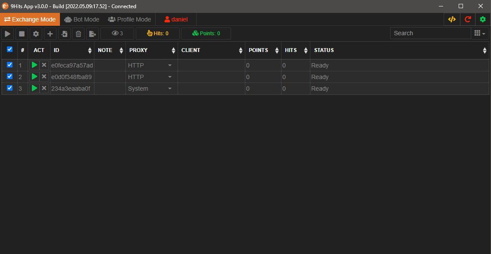
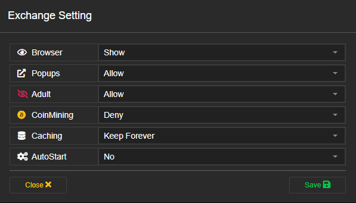
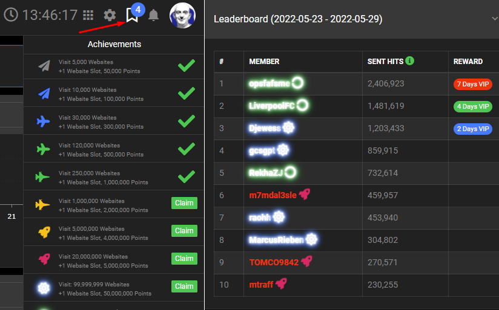

# Exchange Configuration
---------

From the 9Hits App windows, active the Exchange Mode tab

## Manage sessions
A session is like a browser profile in which web pages are viewed by the browser. 9Hits allows you to run multiple sessions on the same machine to optimize point earning, as long as each session has a unique IP address.

* :fontawesome-solid-play: Run selected sessions
* :fontawesome-solid-stop: Stop selected sessions
* :fontawesome-solid-gear: Open exchange settings
* :fontawesome-solid-plus: Add a new session
* :fontawesome-solid-file-import: Mass add sessions from a proxy list
* :fontawesome-regular-trash-can: Delete selected sessions
* :fontawesome-solid-file-export: Export proxy from sessions to clipboard

!!! warning "Attention!"
    You should not abuse running too many sessions beyond the capacity of the machine. This can make your sessions less efficient, even rejected by the system.

## Session properties
* ID: A unique id of a session
* Note: Note for the session
* Proxy: 
    * System: Use the real IP
    * HTTP: HTTP proxy
    * Socks4: Socks4 proxy
    * Socks5: Socks5 proxy
    * SSH: SSH proxy
    * ExProxy: External proxy pool, you can just import proxy to [your pool](proxy-pool.md) on the panel or [create your own proxy pool](https://github.com/9hitste/ExProxy-9Hits-Viewer)
* Client: The client information when the session is running
* Points: Earned points from the session
* Hits: Sent hits from the session
* Status: Status of the session

## Exchange setting
Press the :fontawesome-solid-gear: button to open the exchange setting window

* Browser Show/Hide the browser
* Popups Allow/Deny sites that have popups
* Adult Allow/Deny sites that have adult contents
* CoinMining Allow/Deny crypto mining sites
* Caching The longer the cache is kept, the more bandwidth you will save, but it will consume disk space.

## Monitor sessions
Once you have run the application, you can now [monitor your sessions](https://panel.9hits.com/viewer/sessions), there is also a lot of useful information here.

!!! tip
    Pay attention to the Quality column, the higher the quality, the higher your point earning rate and vice versa (the **Rate** column). The three faces respectively: Proxy, connection speed, website loading performance.

## Achievements
By running the exchange mode, you can reach achievements based on the number of websites you have viewed in the system. At each level you will receive the corresponding rewards.

* Visit 5,000 Websites: +1 Website Slot, 50,000 Points
* Visit 10,000 Websites: +1 Website Slot, 100,000 Points
* Visit 30,000 Websites: +1 Website Slot, 300,000 Points
* Visit 120,000 Websites: +1 Website Slot, 500,000 Points
* Visit 250,000 Websites: +1 Website Slot, 1,000,000 Points
* Visit 1,000,000 Websites: +1 Website Slot, 2,000,000 Points
* Visit 5,000,000 Websites: +1 Website Slot, 4,000,000 Points
* Visit 20,000,000 Websites: +1 Website Slot, 5,000,000 Points
* Visit: 99,999,999 Websites: +1 Website Slot, 50,000,000 Points
* Visit: 999,999,999 Websites: +2 Website Slots, +1 Year of VIP
* Visit: 9,999,999,999 Websites: +3 Website Slots, +5 Years of VIP

When you reach any level, you need to press the `Claim` button to claim it
!!! tip
    In addition, if you reach the top 3 position in the weekly leader-board, you will receive the corresponding reward. You can see the rankings at the [9Hits Panel](https://panel.9hits.com/).
