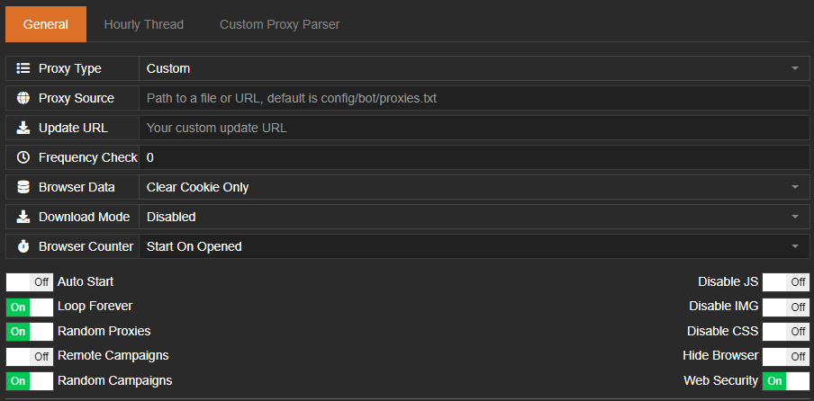
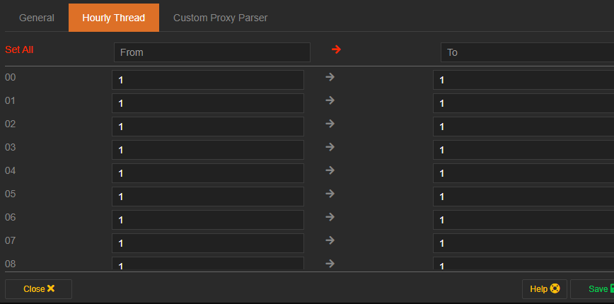
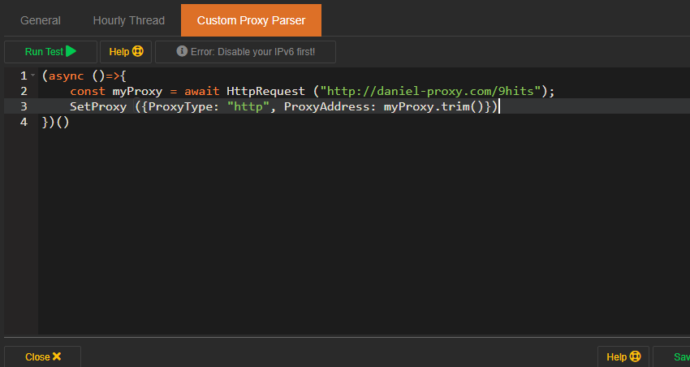

# Bot Configuration
---------

!!! info
    If you want to generate traffic to your website using proxies, you can use bot mode. From the 9Hits App windows, active the Bot Mode tab, press the :fontawesome-solid-gear: button to open the bot setting window.



## General Setting
* Proxy Type: Specify the type of proxy you intend for the bot to use, supported types include: HTTP, Socks4/5, SSH and [Custom](#custom-proxy-parser).
* Proxy Source: The source to your proxy list, can be a path to a file on your computer, or a url. If left blank, the app will read the default file `config/bot/proxies.txt`. The proxy in your list needs to be in the correct format `ip:port;user;password;country;timezone_id;longitude;latitude` where `ip` is required, remaining fields are optional. If the proxy has full information about the country, timezone, geo. The app will use them to spoof on the browser, you can use [the GEO tool](geo-proxy.md) to achieve this. Here is an example of a proxy list:
```
184.82.229.132;root;admin;TH;Asia/Bangkok;100.4536;13.7653
180.183.129.38;admin;admin;TH;Asia/Bangkok;100.5003;13.6855
36.226.43.79;user;user;TW;Asia/Taipei;121.5422;24.9389
61.64.85.228;user;user;TW;Asia/Taipei;121;24
89.96.103.170;test;test;IT;Europe/Rome;9.1922;45.4722
190.46.181.66;admin;0l0ctyQh243O63uD;CL;America/Santiago;-70.6653;-33.4513
91.79.251.202;support;support;RU;Europe/Moscow;37.6068;55.7386
111.248.209.84;user;user;TW;Asia/Taipei;121.5324;25.0504
169.239.236.80;system;OkwKcECs8qJP2Z;NG;Africa/Lagos;8;10
85.163.104.74;admin;123456;CZ;Europe/Prague;15.9509;49.3364
36.225.189.155;user;user;TW;Asia/Taipei;120.4859;23.1355
114.44.169.241;support;support;TW;Asia/Taipei;121.5422;24.9389
62.11.226.25;user;admin;IT;Europe/Rome;9.2545;39.2279
125.236.200.166;system;OkwKcECs8qJP2Z;NZ;Pacific/Auckland;174.7679;-36.8506
180.183.97.6;admin;admin;TH;Asia/Bangkok;100.5172;13.7512
36.237.75.103;user;user;TW;Asia/Taipei;120.3139;22.6148
170.79.88.66;system;OkwKcECs8qJP2Z;CO;America/Bogota;-75.2374;4.4337
190.90.193.96;admin;0l0ctyQh243O63uD;CO;America/Bogota;-74.0943;4.6089
105.255.209.181;system;OkwKcECs8qJP2Z;ZA;Africa/Johannesburg;18.4811;-34.0486
114.38.183.191;user;user;TW;Asia/Taipei;120.5408;24.0662
```
* Update URL / Frequency Check: Please read the [cusom update document](custom-update.md).
* Browser Data: Tell the bot how to handle website data, the options are: `Clear All`, `Clear Cache Only`, `Clear Cookie Only`, `Keep All`

* Auto Start: Auto start the bot once the app is open.
* Loop Forever: Loop your proxy list forever. If you disable this option, the bot will stop when all your proxies has been used
* Random Proxies: Use the proxies list randomly
* Random Campaigns: Use the campaigns randomly
* Disable JS/IMG/CSS: Disable the respective content
* Hide Browser: Hide the browser while the bot is running
* Web Security: Toggle web security policy

## Hourly Thread
You can set the number of threads (number of browsers running at the same time) by hours. It may be the same or different



## Custom Proxy Parser
If you set the **Proxy Type** option to **Custom** in the [General Setting](#general-setting), you need to write your custom proxy parser script. Please read the instructions below carefully!


Your script needs to be written in javascript syntax. You can also test your code by press **Run Test** button. Here are some available functions and constants, details are as follows:
### SetProxy
This is the most important function, once you have obtained the proxy from your script, call the SetProxy function and pass it a required proxy object. Other information if provided such as CountryCode, Latitude, Longitude, TimezoneId. The bot will use to spoof the corresponding browser language, GEO, timezone.

???+ example "Example"
    ``` js linenums="1"
    SetProxy ({
        ProxyType: "http",              //required
        ProxyAddress: "12.34.56.99",    //required
        ProxyUser: "",                  //optional
        ProxyPassword: "",              //optional
        CountryCode: "SG",              //optional
        Latitude: "1.3078",             //optional
        Longitude: "103.6818",          //optional
        TimeZoneId: "Asia/Singapore"    //optional
    })
    ```

### HttpRequest 
Make a HTTP request

???+ info "Syntax"
    ``` js
    HttpRequest (url, postData);
    ```

???+ abstract "Parameters"
    | Name      | Description                          |
    | ----------- | ------------------------------------ |
    | `url`       | URL to send request.  |
    | `postData`       | Post Parameters (optional).  |

???+ example "Example"
    ``` js linenums="1"
    //promise
    HttpRequest("http://my-proxy-server.com").then(result => {
        SetProxy ({
            ProxyType: "http",
            ProxyAddress: result
        });
    });

    //async
    (async ()=>{
        const result = await HttpRequest("http://my-proxy-server.com", {from: "9hits-bot"});
        SetProxy ({
            ProxyType: "http",
            ProxyAddress: result
        });
    })()
    ```

### ReadFile 
Read a file and return as text.

???+ info "Syntax"
    ``` js
    ReadFile (path);
    ```

???+ abstract "Parameters"
    | Name      | Description                          |
    | ----------- | ------------------------------------ |
    | `path`       | path to the file.  |

???+ example "Example"
    ``` js linenums="1"
    const myRotating = ReadFile("/home/daniel/myRotating.text");
    SetProxy ({
        ProxyType: "http",
        ProxyAddress: myRotating
    });
    ```

### SetStatus 
Show a status text to the thread that calling your parser script.

???+ info "Syntax"
    ``` js
    SetStatus (text);
    ```

???+ abstract "Parameters"
    | Name      | Description                          |
    | ----------- | ------------------------------------ |
    | `text`       | a text content.  |

???+ example "Example"
    ``` js linenums="1"
    (async ()=>{
        SetStatus("Connecting to my-proxy-server...");
        const result = await HttpRequest("http://my-proxy-server.com");
        SetProxy ({
            ProxyType: "http",
            ProxyAddress: result
        });
    })()
    ```
### Constants and Variables
???+ example "You can use these constants and variables in your script"
    ``` js linenums="1"
    ThreadId        //Id of the thread that calling your parser script
    ThreadIndex     //Index of the thread that calling your parser script (zero base)
    WorkingDir      //The current working dir of the bot
    Global          //A global object exists between the threads and your script executions, useful for storing global data.
    ```

## Monitor Sessions
Once your bot is started, you can monitor the status of your running bots [here](https://panel.9hits.com/bot/sessions).