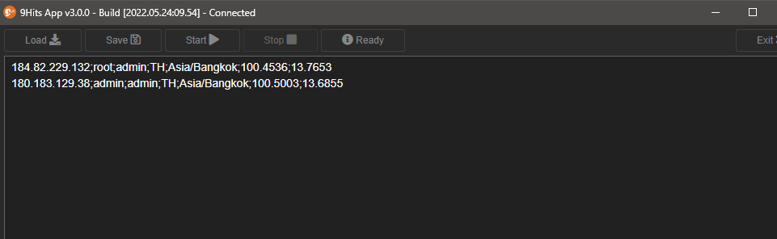

# GEO proxy list

---------

## What for?
If there is more information about your proxy, the bot will spoof the browser more deeply. Details are as follows:

* Country: Ability to spoof browser language (default is en-US), this is required if you want [the Languages option](manage-campaign.md) of your campaign works.
* TimezoneID: Spoof timezone
* Longitude and Latitude: Spoof GEO location

## How to?
From the Bot Mode tab, click the :fontawesome-solid-globe: button to open the GEO tool

You can paste your proxy list here or click the `Load` button to automatically get the proxy list from the setting. Click the `Start` button to start the GEO, once done, you can save the results with the `Save` button or just copy it.