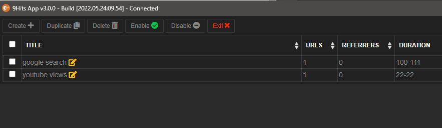

# Manage your campaigns

---------

## Open campaign manager
From the Bot Mode tab, press the :fontawesome-regular-flag: button to open the campaign manager

## Campaign properties
* Title: Naming your campaign
* Urls: Links to receive traffic, one link per line, the bot will use randomly.
* Referrers: Link to fake sources, one link per line, the bot will use randomly.
* Duration: Range of duration to view your website, the bot will view at a random duration between the range that you set
* Enabled: Enable/Disable the campaign.
* Main Macro: Macros to execute while the browser is viewing your site.
* Popups Macros: Macros to execute on every opened popups.
* Max Popups: The number of popups allowed to open.
* Block Request: Block urls on the browser by patterns or regular expression.
* Languages: Set the browser language by country of the current IP viewing your website. By default it will be en-US, to make this feature work, you need to [GEO your proxy list](geo-proxy.md).
* Inject Script: Inject javascript code to run on your webpage.