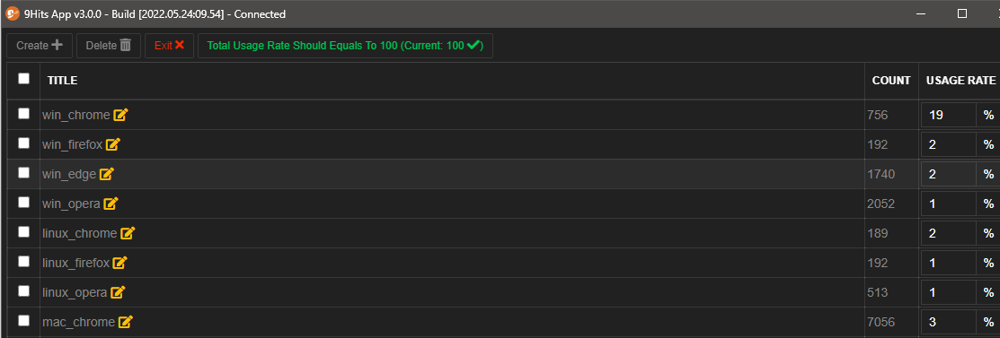

# Manage your user-agent

---------

## Open user-agent manager
From the Bot Mode tab, press the :fontawesome-solid-mask: button to open the user-agent manager

## User-agent group properties
* Title: Naming your user-agent group
* Settings:
    * ScreenSize: Size of the screen to spoof
    * Color/Pixel Depth: Color/pixel depth of the screen to spoof
    * Touch: Enable touch events on the browser
    * DPR:  Spoof device pixel ratio. Normally use on the mobile user agent. Example value: 1, 1.5, 2, 2.5. set to zero to use the default.
* User-Agent List: List of user agent string, one per line.

!!! tip
    You can go to [developers.whatismybrowser.com](https://developers.whatismybrowser.com) or any other sources to get more user agents. For the screen sizes, you may visit [screensiz.es](https://screensiz.es)

## How does the bot use your user agents
The bot will randomly select an user-agent group based on the USAGE RATE you set, then continue to randomly select a setting and an user-agent string to use.