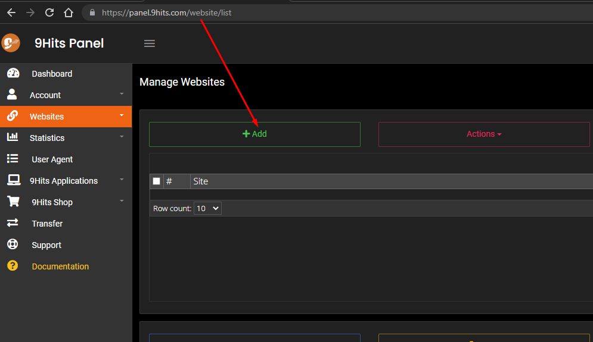

# Manage your campaigns

---------

After creating a free account at 9Hits, the first step is to [create and manage your campaigns here](https://panel.9hits.com/website/list). Below are the details of your campaign options



## Campaign properties

#### Title
Give your campaign any name, as long as it makes it easy for you to remember and manage.

#### Is Adult
Specify whether your site has adult content or not. Note that if you intentionally choose the wrong answer, your account may be banned.

#### Has Coin Mining
Specify whether your site has coin mining script or not. Note that if you intentionally choose the wrong answer, your account may be banned.
In case you set this option to No, the system will still automatically scan your campaign and warning you if it finds any coin mining activities.

#### URL
Your website URL, you can place one or more links (one per line). The system will randomly select the links you have set. Traffic will be shared equally for the links.

#### Referrers
This option allows you to spoof traffic sources.

* Basic mode: You can set one or more source URLs, one per line. The system will select the link to simulate the traffic source at an equal rate.
* Advanced mode: Similar to the basic mode, but you can set the rate for each individual link. For example, we set 60% of the source from facebook, 25% from twitter and 15 is direct.


#### Duration
Time to view your website, up to 600 seconds

#### Platforms
By default, the system will spoof the User-Agent of mobile and desktops devices with a set of User-Agents managed by 9Hits. You can also manage to use [your custom User-Agent](user-agent.md) as well as set the rate of using them.


#### Macros
This is one of the unique features of 9Hits. It allows you to create interactions on your website without the need for real user interaction. A simple example, you want after your website is loaded, there will be a click on any link. You can set macros to run on main browser window or popup windows, the main script will only run on the main (first) browser window, the popup script will run on any opened popup. [Learn more about Macros](../../macros/overview.md)

#### Connection Types
The 9Hits App supports most types of proxies. This option allows you to filter visitors according to the type of proxy it is using, where the System is the real IP of the computer. It is recommended that you select them all.

#### Connection Speed
Allows you to filter visitors according to their network connection speed

#### Performance
Allows you to filter visitors according to their computer performance, for example, a computer with a CPU that is always 90 to 100% will be treated as slow performance

#### GEO Targeting
Filter visitors by geographic location, you can filter by country or continent. There are two filtering rules: Only Selected or Except Selected items

#### Frequency Capping
Using this option allows you to limit the frequency of viewing your website by the same visitor (IP address). For example, the same visitor is only allowed to view your website once every hour, every 8 hours, or every 24 hours, and so on.

This option is normally applied to only one single campaign (This Site Only). But you can also set up a group of campaigns (Share with ...). For example, you have campaign **Website 1** with a frequency of 24 hours, campaign **Website 2**, **Website 3**, with the frequency shared with campaign **Website 1**. So within 24 hours, the same visitor can view only one of the three campaigns, if viewed 1 will not view 2 and 3, viewed 2 will not view 1 and 3, viewed 3 will not view 1 and 2. Please note that in this frequency group, **Website 1** is the master, so the frequency type must be This Site Only.


#### Accept Languages
This is a browser header, the default is en-US, if you select countries, then Accept Languages will be set according to that countries. For example, a visitor from Spain will have Accept Languages as es-es instead of the default en-US

#### Force Hide
Force the viewer to hide the browser when viewing your site (in case you want to keep your site private).

#### Fingerprint Spoof
Every web browser can be calculated to identify its [fingerprint](https://en.wikipedia.org/wiki/Device_fingerprint#Browser_fingerprint) based on a variety of information. By spoofing this information, the traffic sent to your site will look more real. You can check for browser's fingerprint [here](https://browserleaks.com/) or any similar tools.

#### Max Hits
imit the number of views for your campaign. **Be careful** when using this option because your campaign will stop receiving visits when it reaches the number of views you have set. You may want to use the [Hourly Limit](#hourly-limit) option instead!

#### Until Date
Only receive traffic until a specified date (based on server time)

#### Max Popups
The number of popups allowed to open when a visitor is viewing your site. Popup can be opened automatically by ads on your website or by an interaction like clicks. Note that the more popup you open, the more [POINTS](https://9hits.com/faqs.html) you pay.

#### Allow Proxy
Allow visitors to use proxies to view your website. Note that the system will check the visitor's IP based on many factors. Therefore, a real IP of a visitor may be considered as a bad IP (for example blacklisted), but a quality proxy can be considered as a good IP (private/paid proxies)

#### Allow IPv6
Allow visitors to use IPv6 to view your website. If your website is not compatible with IPv6, you should turn this option off

#### Allow Blocked Popups
The 9Hits Exchange Mode has an option for member to turn off the popup, so this option also allows you to accept views from these members or not.

#### IP Filter
You can block traffic from one or more IP addresses by setting up filtering rules.

**1. Filter types:**

```
1.1: By Session IP  Block traffic from sessions by its IP
1.2: By Machine IP  Block traffic from sessions according to the real IP of the computer running those sessions
1.3: All:           Block traffic from sessions if one of the two rules above is matched
```

**2. Filter rules:**

The Filter rules can be one or more specified IP addresses (separated by commas), or use * as a wildcard. Leave empty to turn off the filter. Be careful! If you set an invalid filter, it may not work properly, some examples:
```
2.1: 1.12.123.45                Block ip 1.12.123.45
2.2: 1.12.123.45,69.126.45.15   Block ip 1.12.123.45 and 69.126.45.15
2.3: 69.126.*,1.12.123.45       Block ip range [69.126.0.0 - 69.126.255.255] and ip 1.12.123.45

IPv6 uses the same logic
```
**3. Some use cases:**

Take a look at the figure below, we have 4 sessions running on a computer with IP address 1.12.123.45.


```
Case 1: Apply 1.1 and 2.1  ss1 is blocked
Case 2: Apply 1.1 and 2.2  ss1 and ss2 are blocked
Case 3: Apply 1.1 and 2.3  ss1, ss2 and ss4 are blocked
Case 4: Apply 1.2 and 2.1  all sessions are blocked
Case 5: Apply 1.3 and 2.1  all sessions are blocked

Note: Any other sessions from other machines that matched your filter will also blocked.
```

#### Hourly Limit
Set the hourly view limit, There are three modes related to speed of sending visits: Normal, Fast, and Slow. Consider yourself and choose the appropriate mode. The number of views can be set for each individual hour. Note that the time is based on the 9Hits server time!

#### Disable Js/Image/Cookie Rate
This is the rate of disabling some browser features. That means if you set to zero mean completely activate and 100 is completely disabled. You can set a rate for any feature. For example, we set to 65, which means the feature is turned off at 65% and turns on at 35%. **Note that turning off Image will affect Googly Analytic.**

#### Ad Safe
Prevent the viewer from loading ads from a specific network, Eg: you dont want the viewer to load Google Ads on your site to avoid your Google Ads account may get banned.

#### Web Security
Enable/Disable Web Security (same-origin policy)

#### Enable Alexa extension
Obsolete

#### State
By default your campaign will be activated as soon as you create it, you can pause and run it later.