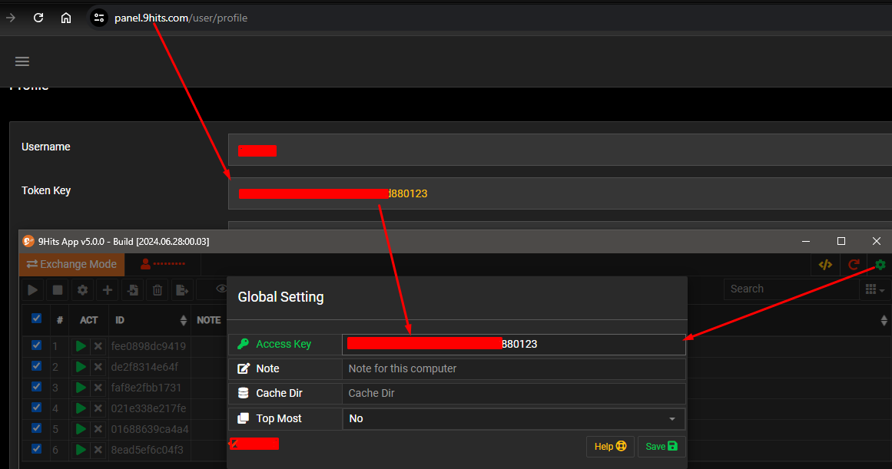

# 9Hits Installation
Install the 9Hits application

---------

## Requirements
#### Hardware requirements:
* CPU with one or more cores, 2GHz
* At least 2G of RAM
#### Software requirements:
* Windows 7, Windows Server 2008 R2 or later
* Ubuntu Desktop 14.04, Debian 8.9, Centos 7.4 or later

## Installation
Please login to the [panel](https://panel.9hits.com/user/profile) and get the download links, the 9Hits App is available on Windows and Linux.
You may have no problem on Windows, but on Linux you may need to install some required libraries and set permissions as follows:

#### RHEL/Centos
    yum update -y
    yum install -y libatomic alsa-lib-devel gtk3-devel libgbm libxkbcommon-x11 cups-libs.i686 cups-libs.x86_64 atk.x86_64 libnss3.so xorg-x11-server-Xvfb sed tar wget bzip2 libXScrnSaver psmisc

#### Ubuntu/Debian

    apt-get update
    apt-get upgrade -y
    apt-get install -y bzip2 libcanberra-gtk-module libxss1 sed tar libxtst6 libnss3 wget psmisc bc libgtk-3-0 libgbm-dev libatspi2.0-0 libatomic1

#### Set permissions

    cd THE_APP_FOLDER
    chmod -R 777 .
    chmod +x ./9HitsApp ; chmod +x ./9hits ; chmod +x ./browser/9hbrowser ; chmod +x ./3rd/9htl

!!! tip
    You may want to [install the app without GUI](https://github.com/9hitste/install)

## Configuration
Once the application is ready, run it and press the :fontawesome-solid-gear:{.txt-success} button to open the Global Setting window, enter your key in the Access Key field, then press the `Save` button.

Details of other options:

* Note: Note for the machine, usefull on the [remote page](./exchange/app-config.md#remote-control)
* Cache Dir: Override browser data default path
* SSH Connector: Library for connecting SSH proxy, Putty is recommended
* Low End Mode: Enable this option to optimize resources on weak machines
* Top Most: Keep the 9Hits App window on top

