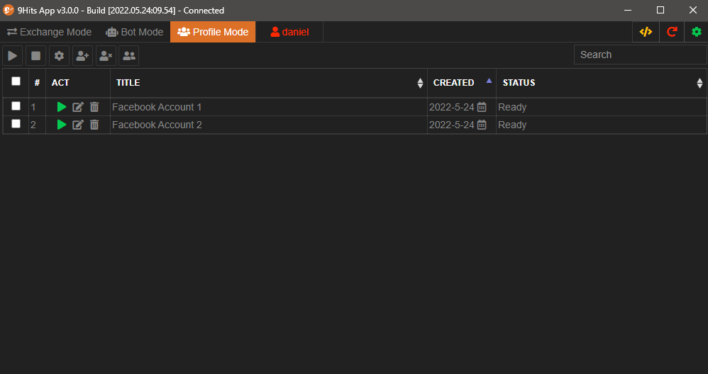

# Profile Mode

---------

## Overview
Unlike the Bot Mode, Profile Mode allows you to create and manage separate profiles, for registering/logging multiple accounts on the same website or any similar purposes.

From the 9Hits App windows, active the Profile Mode tab

## Profile properties

=== "General"

    * Title: Naming your profile
    * User Agent: User Agent string, default is chrome
    * Urls: Links to receive traffic, one link per line, the bot will use randomly.
    * Referrers: Link to fake sources, one link per line, the bot will use randomly.
    * Main Macro: Macros to execute while the profile is running.
    * Popups Macros: Macros to execute on every opened popups.
    * Duration: How long should the website is open (in seconds), 0 mean unlimited.
    * Browser Width/Height: Browser size.
    * Proxy: Proxy information: Type, server, user/pass

=== "Browser"

    * Visiblity: Show/Hide the browser
    * Timezone: Timezone to spoof
    * Block Request: Block urls on the browser by patterns or regular expression.
    * Languages: The browser language
    * Max Popups: Maximum number of popups that can be opened.
    * JS/IMG/CSS/Websicurity: Enable/Disable the browser features
    * Plugin and mime types: Spoof browser plugins
    * WebGL: Spoof webgl fingerprint
    * Inject Script: Inject javascript code to run on your webpage.

=== "HTTP Headers"

    * Reorder headers
    * Remove headers
    * Override headers
    
=== "GEO"

    Spoof GEO location

=== "Screen"

    Spoof Screen information

=== "Others"

    * Canvas fingerprint
    * Audio fingerprint
    * Rect fingerprint
    * Font fingerprint
    * WebRTC spoof
    * CPUs spoof
    * Memory spoof