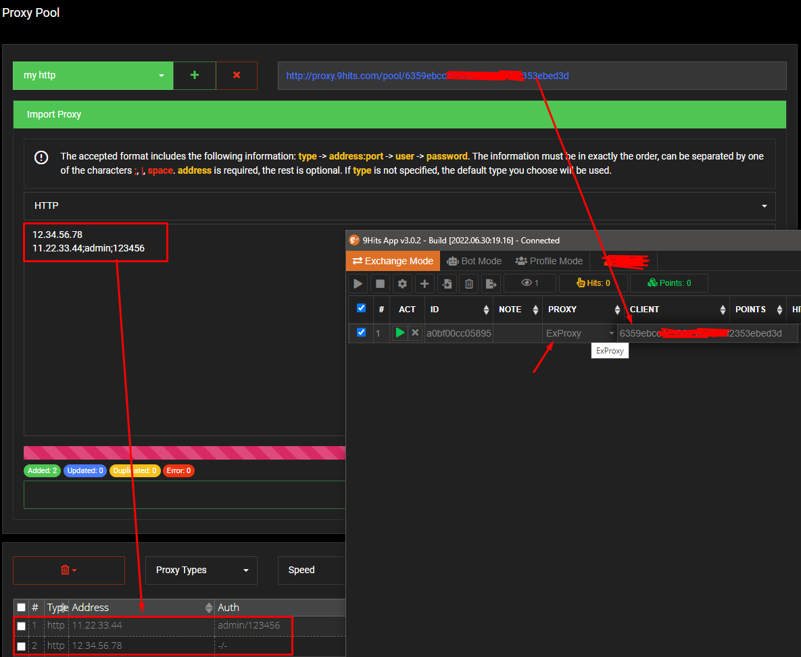
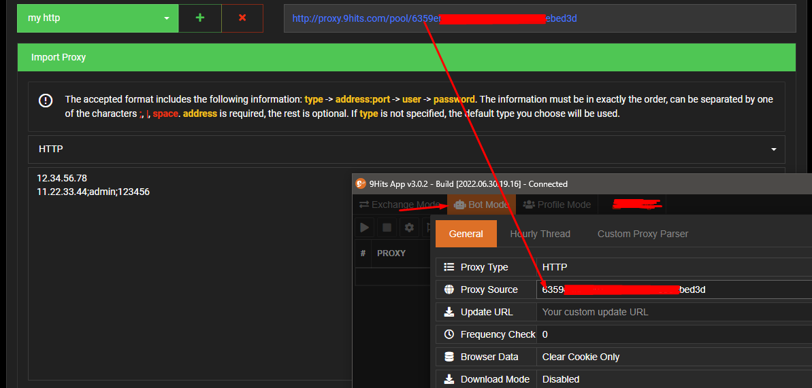

# Manage your proxy pools

---------

## What is a proxy pool?
In the `bot` or `exchange` mode, the app can use proxies from an external source (by passing a source URL), you can [build a proxy server](https://github.com/9hitste/ExProxy-9Hits-Viewer) yourself for the `exchange` mode, or use the [built-in proxy server](https://panel.9hits.com/pool/index) hosted at 9Hits, managing the pools is quite simple, just follow the instructions in [the manage page](https://panel.9hits.com/pool/index).

## How to use?
Once you have created the pool and imported your proxies, you can either get the URL or just the pool key and set it to a session or the `Proxy Source` option in the `bot` mode settings. You can use your pools privately or share it with any other member.

