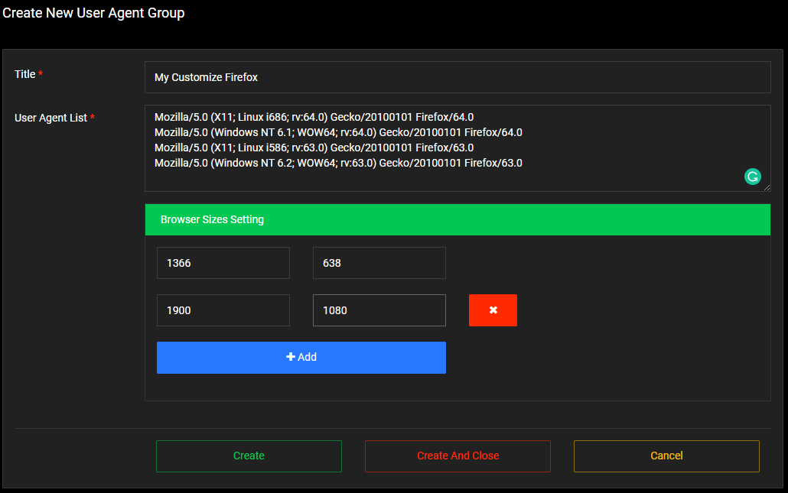

# Customizing User Agent
---------

## Manage your user-agent
The custom user-agents are used for the [Platform option](manage-campaign.md#platforms) in your campaign. Manage your custom-user agent [here](https://panel.9hits.com/useragent/list).

* **Title**: Name the new User-Agent group
* **User Agent List**: List of your User-Agent, one line per item.
* **Browser Sizes Setting**: Add the browser sizes used for a list of user-agents that you set up above.

## How its works
The system will randomly take an user-agent from your list, a random size that you have added and then use them for viewing your websites from the 9Hits Application.