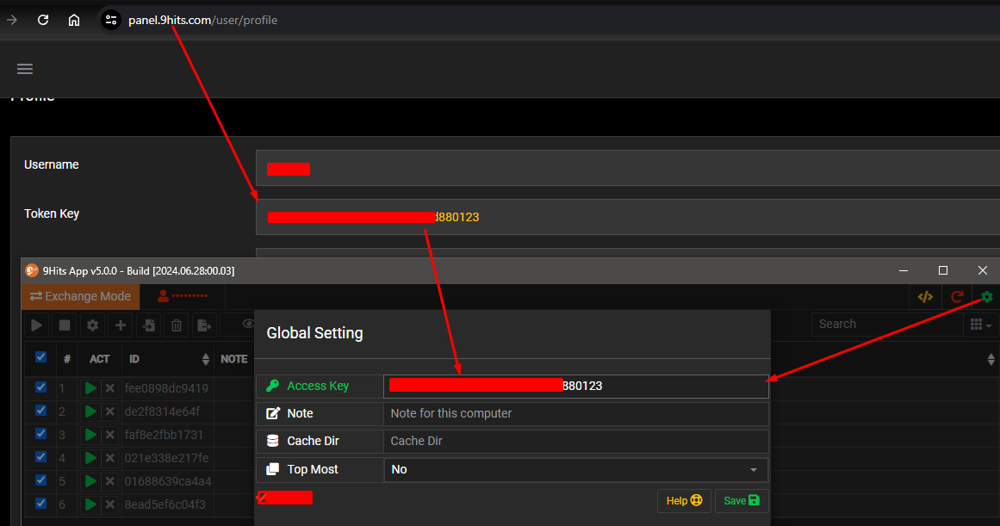
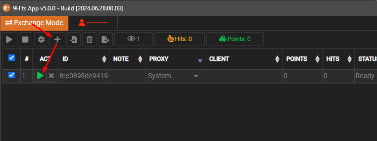
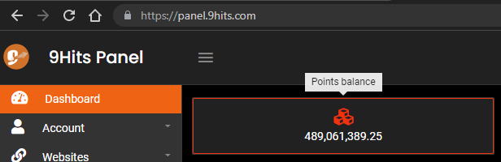
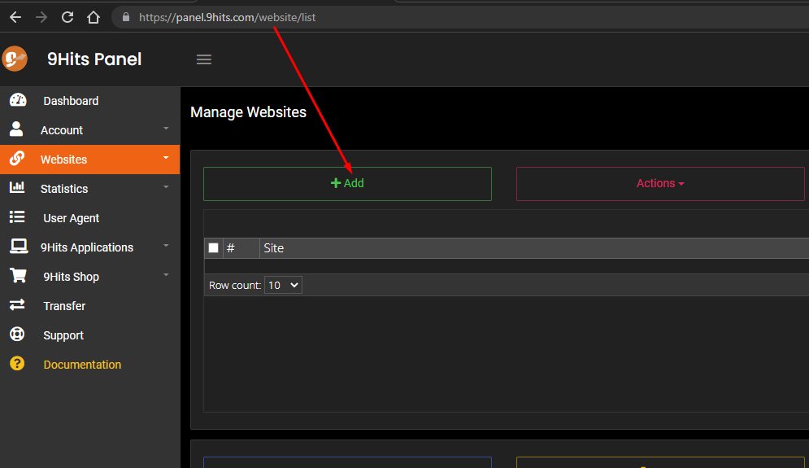

# Getting Started with 9Hits
---------

## Opening a free account
It is free to register an account at 9Hits, [click here](https://panel.9hits.com/register) to create one.

## Running the 9Hits Application
[Install](9hits-app/installation.md) and run the 9Hits App, get your token key at the [profile page](https://panel.9hits.com/user/profile). You may wanna read more about the [app configuration](9hits-app/app-config.md).

Active the `Exchange Mode` tab, press the :fontawesome-solid-plus: button to add a new session, then press the :fontawesome-solid-play:{.txt-success} button to start exchanging traffic with the other members.

!!! info
    By running the application, you will start viewing other members' websites in the system and earn :fontawesome-solid-cube:{.txt-danger} [POINTS](https://9hits.com/faqs.html) to your account.
    
    

## Creating a new campaign
To start getting traffic, create your first campaign [here](https://panel.9hits.com/website/list). For more details, see the [Campaign Manage](9hits-app/manage-campaign.md). Once your campaign is ready, you will start getting views from other members in the same way you view them with the 9Hits App. You will pay 1 [POINTS](https://9hits.com/faqs.html) for every 1 second your website is viewed. You can earn free [POINTS](https://9hits.com/faqs.html) by running the app as instructed, or just buy it [here](https://panel.9hits.com/shopping/points).

## Getting help
Feel free to create [ticket](https://panel.9hits.com/ticket/index), join our [discord](https://discord.gg/vymp5Wuu9M) or [forum](https://forum.9hits.com/).