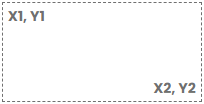
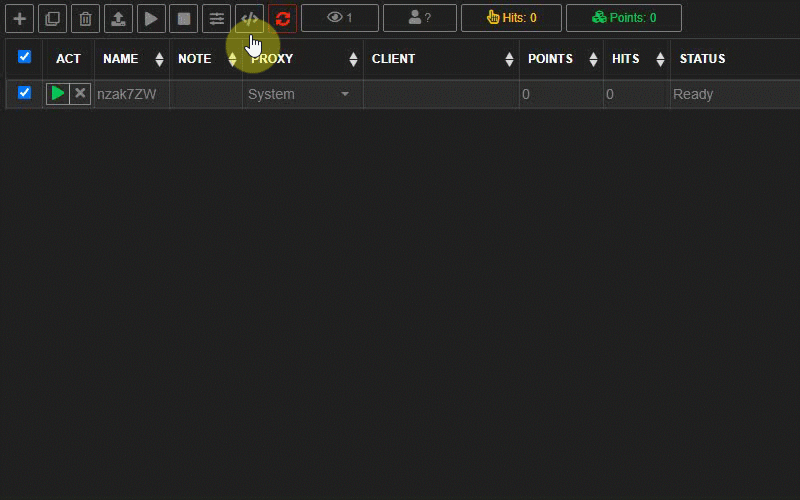
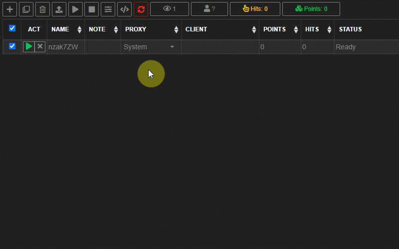

# 9Hits Macros Build-in Functions

---------

!!! danger "Note"
    Some functions are required **await** keyword

## TheCampaign object
You can get some informations of your campaign from TheCampaign object. This object is available on the Exchange Mode only.

``` js linenums="1"
const TheCampaign  = { 
    "id": 123,
    "url": "http://google.com",
    "duration": 15
}

////For example, to get the campaign ID, you can use
TheCampaign.id
```

## Log
Print one or more message to the Macros Editor output.

???+ info "Syntax"
    ``` js
    Log(msg1[, msg2, msg3, ...);
    ```

???+ abstract "Parameters"
    | Name      | Description                          |
    | ----------- | ------------------------------------ |
    | `msg1`       | Message to show on the Output tab on the Macros Editor   |
    | `...`       | Message to show on the Output tab on the Macros Editor   |
    | `msg_n`       | Message to show on the Output tab on the Macros Editor   |

???+ example "Example"
    ``` js linenums="1"
    await WaitForLoading ();
    Log("hello", new Date(), await EvalScript ("location.href"));
    ```

## Delay
Pause the script for a period of time in milliseconds.

???+ info "Syntax"
    ``` js
    await Delay (ms [, ms2]);
    ```

???+ abstract "Parameters"
    | Name      | Description                          |
    | ----------- | ------------------------------------ |
    | `ms`       | Delay time in miliseconds.   |
    | `ms2`       | Delay in the range from `ms` to `ms2` (optional).   |


???+ example "Example"
    ``` js linenums="1"
    await Delay(3000);//delay for 3 seconds
    await Delay(3000, 10000);//delay random between 3-10 seconds
    ```

## Random
Returns a random integer that is within a specified range.

???+ info "Syntax"
    ``` js
    await Random (num1 [, num2]);
    ```

???+ abstract "Parameters"
    | Name      | Description                          |
    | ----------- | ------------------------------------ |
    | `num1`       | Random a number from 0 to num1.   |
    | `num2`       | Random a number between `num1` and `num2` (optional).   |

???+ example "Example"
    ``` js linenums="1"
    const r1 = Random(3); //random a number from 0 to 3 (3 excluded)
    const r2 = Random(5, 10);  //random a number between 5 and 10 (10 excluded)
    ```

## RandomArray
Take a random item from an array.

???+ info "Syntax"
    ``` js
    await RandomArray (array);
    ```

???+ abstract "Parameters"
    | Name      | Description                          |
    | ----------- | ------------------------------------ |
    | `array`       | An array of any element   |

???+ example "Example"
    ``` js linenums="1"
    const randomKeyword = RandomArray(["traffic exchange", "auto surf"]);
    Log (randomKeyword);
    ```

## ClickByCoordinates
Click on an area on your website based on coordinates.

???+ info "Syntax"
    ``` js
    await ClickByCoordinates (x1, y1, x2, y2, nClick=1);
    ```

???+ abstract "Parameters"
    | Name      | Description                          |
    | ----------- | ------------------------------------ |
    | `x1`       | x coordinate of the top-left   |
    | `y1`       | y coordinate of the top-left   |
    | `x2`       | x coordinate of the right-bottom   |
    | `y2`       | y coordinate of the right-bottom   |
    | `nClick`       | Click count, default is 1   |

    

???+ example "Example"
    ``` js linenums="1"
    await ClickByCoordinates(100, 100, 200, 200);
    await ClickByCoordinates(100, 100, 200, 200, 2);
    ```

???+ tip
    You can also get the coordinates from [the Editor](overview.md#writing-your-script) like this
    
    

## ClickBySelector 
Click on an element based on a css selector.

???+ info "Syntax"
    ``` js
    await ClickBySelector (selector, index=0, nClick = 1, frameSearch="", frameSearchType="");
    ```

???+ abstract "Parameters"
    | Name      | Description                          |
    | ----------- | ------------------------------------ |
    | `selector`       |  a [CSS selector](https://www.w3schools.com/cssref/css_selectors.asp)   |
    | `index`       |  Index of the element in case there are more than one elements matched the selector. You can use number (`0` for the first element) or `"random"` to randomly click an element, default is `0`.   |
    | `nClick`       | Click count, default is 1   |
    | `frameSearch`       | If the target element is in an iframe, you have to tell the macros what frame is, empty mean top main frame.   |
    | `frameSearchType`       |  Frame search conditions, possible value: `"src-starts"`, `"src-ends"`, `"src-equals"`, `"src-contains"`, `"src-regex"`, `"frame-path"`, default is `"src-contains"`.   |

???+ example "Example"
    ``` js linenums="1"
    //click to a link that contains 9hits.com
    await ClickBySelector("a[href*='9hits.com']");

    //click to a button with id #submit, inside an iframe which has src starts with http://9hits.com
    await ClickBySelector("button#submit", 0, 1, "https://9hits.com", "src-starts");

    //click to a button with id #submit, inside an iframe which has src equals to http://9hits.com/contact.html
    await ClickBySelector("button#submit", 0, 1, "https://9hits.com/contact.html", "src-equals");

    //click to a button with id #submit, inside an iframe which has src ends with /contact.html
    await ClickBySelector("button#submit", 0, 1, "/contact.html", "src-ends");

    //click to a button with id #submit, inside an iframe which has src contains 9hits.com
    await ClickBySelector("button#submit", 0, 1, "9hits.com", "src-contains");

    //click to a button with id #submit, inside an iframe which has src matched regex \d+hits\.com
    await ClickBySelector("button#submit", 0, 1, "\d+hits\.com", "src-regex");

    //click to a button with id #submit, inside the first frame
    await ClickBySelector("button#submit", 0, 1, "0", "frame-path");

    //click to a button with id #submit, inside the 2nd frame of the first frame
    await ClickBySelector("button#submit", 0, 1, "0>1", "frame-path");
    ```

???+ tip
    Are you confused? Don't worry! You can also generate this click command easily by using [the Editor](overview.md#writing-your-script) like this.

    

## ClickById 
Click on an element based on its ID.

???+ info "Syntax"
    ``` js
    await ClickById (id, nClick=1, frameSearch="", frameSearchType="");
    ```

???+ abstract "Parameters"
    | Name      | Description                          |
    | ----------- | ------------------------------------ |
    | `id`       |  ID of the element.   |
    | `nClick`       | Click count, default is 1   |
    | `frameSearch`       | See [ClickBySelector](#clickbyselector)   |
    | `frameSearchType`       | See [ClickBySelector](#clickbyselector)   |


???+ example "Example"
    ``` js linenums="1"
    await ClickById("load-more-button");
    ```

## ClickByXpath 
Click on an element based on its xpath.

???+ info "Syntax"
    ``` js
    await ClickByXpath (xpath, nClick=1, frameSearch="", frameSearchType="");
    ```

???+ abstract "Parameters"
    | Name      | Description                          |
    | ----------- | ------------------------------------ |
    | `xpath`       |  xpath of the element. You may use the [GenerateXpath](#generatexpath) function to generate xpath.   |
    | `nClick`       | Click count, default is 1   |
    | `frameSearch`       | See [ClickBySelector](#clickbyselector)   |
    | `frameSearchType`       | See [ClickBySelector](#clickbyselector)   |


???+ example "Example"
    ``` js linenums="1"
    await ClickByXpath("/html/body/div/div[1]/div/ul/li[6]/a/div[1]/span");
    await ClickByXpath(GenerateXpath("a", "href", "https://9hits.com%"));
    ```

## ClickByTag 
Click on an element based on its tag name.

???+ info "Syntax"
    ``` js
    await ClickByTag (tag, index, nClick=1, frameSearch="", frameSearchType="");
    ```

???+ abstract "Parameters"
    | Name      | Description                          |
    | ----------- | ------------------------------------ |
    | `tag`       |  Tag name of the element. |
    | `index`       |  Index of the element in case there are more than one elements has the same tag name. You can use number (`0` for the first element) or `"random"` to randomly click an element, default is `0`.   |
    | `nClick`       | Click count, default is 1   |
    | `frameSearch`       | See [ClickBySelector](#clickbyselector)   |
    | `frameSearchType`       | See [ClickBySelector](#clickbyselector)   |

???+ example "Example"
    ``` js linenums="1"
    await ClickByXpath("/html/body/div/div[1]/div/ul/li[6]/a/div[1]/span");
    await ClickByXpath(GenerateXpath("a", "href", "https://9hits.com%"));
    ```

## ClickByClass 
Click on an element based on its class name.

???+ info "Syntax"
    ``` js
    await ClickByClass (class, index, nClick=1, frameSearch="", frameSearchType="");
    ```

???+ abstract "Parameters"
    | Name      | Description                          |
    | ----------- | ------------------------------------ |
    | `class`       |  Class name of the element. |
    | `index`       |  Index of the element in case there are more than one elements has the same class name. You can use number (`0` for the first element) or `"random"` to randomly click an element, default is `0`.   |
    | `nClick`       | Click count, default is 1   |
    | `frameSearch`       | See [ClickBySelector](#clickbyselector)   |
    | `frameSearchType`       | See [ClickBySelector](#clickbyselector)   |

???+ example "Example"
    ``` js linenums="1"
    await ClickByClass("skip-button"); //Click to the first element has class name "skip-button"
    await ClickByClass("skip-button", 1); //Click to the 2nd element has class name "skip-button"
    await ClickByClass("skip-button", "random"); //Click to the random any element has class name "skip-button"
    ```

## ClickRandomLink 
Randomly click any link on your website.

???+ info "Syntax"
    ``` js
    await ClickRandomLink (frameSearch="", frameSearchType="");
    ```

???+ abstract "Parameters"
    | Name      | Description                          |
    | ----------- | ------------------------------------ |
    | `frameSearch`       | See [ClickBySelector](#clickbyselector)   |
    | `frameSearchType`       | See [ClickBySelector](#clickbyselector)   |

???+ example "Example"
    ``` js linenums="1"
    await ClickRandomLink();
    ```


## ClickRandomInternalLink 
Randomly click any internal link on your website.

???+ info "Syntax"
    ``` js
    await ClickRandomInternalLink (frameSearch="", frameSearchType="");
    ```

???+ abstract "Parameters"
    | Name      | Description                          |
    | ----------- | ------------------------------------ |
    | `frameSearch`       | See [ClickBySelector](#clickbyselector)   |
    | `frameSearchType`       | See [ClickBySelector](#clickbyselector)   |

???+ example "Example"
    ``` js linenums="1"
    await ClickRandomInternalLink();
    ```


## ClickRandomExternalLink 
Randomly click any external link on your website.

???+ info "Syntax"
    ``` js
    await ClickRandomExternalLink (frameSearch="", frameSearchType="");
    ```

???+ abstract "Parameters"
    | Name      | Description                          |
    | ----------- | ------------------------------------ |
    | `frameSearch`       | See [ClickBySelector](#clickbyselector)   |
    | `frameSearchType`       | See [ClickBySelector](#clickbyselector)   |

???+ example "Example"
    ``` js linenums="1"
    await ClickRandomExternalLink();
    ```

## SetById 
Set the value for an attribute of an element based on its ID.

???+ info "Syntax"
    ``` js
    await SetById (id, attr, value, frameSearch="", frameSearchType="");
    ```

???+ abstract "Parameters"
    | Name      | Description                          |
    | ----------- | ------------------------------------ |
    | `id`       | ID of the element.   |
    | `attr`       | The attribute you want to set.  |
    | `value`       | The value you want to set.  |
    | `frameSearch`       | See [ClickBySelector](#clickbyselector)   |
    | `frameSearchType`       | See [ClickBySelector](#clickbyselector)   |

???+ example "Example"
    ``` js linenums="1"
    await SetById("email", "value", "support@9hits.com");
    ```

## SetByXpath 
Set the value for an attribute of an element based on its xpath.

???+ info "Syntax"
    ``` js
    await SetByXpath (xpath, attr, value, frameSearch="", frameSearchType="");
    ```

???+ abstract "Parameters"
    | Name      | Description                          |
    | ----------- | ------------------------------------ |
    | `xpath`       | Xpath of the element.   |
    | `attr`       | The attribute you want to set.  |
    | `value`       | The value you want to set.  |
    | `frameSearch`       | See [ClickBySelector](#clickbyselector)   |
    | `frameSearchType`       | See [ClickBySelector](#clickbyselector)   |

???+ example "Example"
    ``` js linenums="1"
    await SetByXpath ('//input[@type="email"]', 'value', 'support@9hits.com');
    ```

## SetByClass 
Set the value for an attribute of an element based on its class name.

???+ info "Syntax"
    ``` js
    await SetByClass (class, attr, value, index, frameSearch="", frameSearchType="");
    ```

???+ abstract "Parameters"
    | Name      | Description                          |
    | ----------- | ------------------------------------ |
    | `class`       | Class name of the element.  |
    | `attr`       | The attribute you want to set.  |
    | `value`       | The value you want to set.  |
    | `index`       | Index of the element in case there are multiple elements with the same class name. 0 is the first element, you can also use `"random"` or `"all"`.  |
    | `frameSearch`       | See [ClickBySelector](#clickbyselector)   |
    | `frameSearchType`       | See [ClickBySelector](#clickbyselector)   |

???+ example "Example"
    ``` js linenums="1"
    await SetByClass("text-box", "value", "text value");
    await SetByClass("text-box", "value", "text value", 2);
    await SetByClass("text-box", "value", "text value", "random");
    await SetByClass("text-box", "value", "text value", "all");
    ```

## SetByTag 
Set the value for an attribute of an element based on its tag name.

???+ info "Syntax"
    ``` js
    await SetByTag (tag, attr, value, index, frameSearch="", frameSearchType="");
    ```

???+ abstract "Parameters"
    | Name      | Description                          |
    | ----------- | ------------------------------------ |
    | `tag`       | Tag name of the element.  |
    | `attr`       | The attribute you want to set.  |
    | `value`       | The value you want to set.  |
    | `index`       | Index of the element in case there are multiple elements with the same tag name. 0 is the first element, you can also use `"random"` or `"all"`.  |
    | `frameSearch`       | See [ClickBySelector](#clickbyselector)   |
    | `frameSearchType`       | See [ClickBySelector](#clickbyselector)   |

???+ example "Example"
    ``` js linenums="1"
    await SetByTag("input", "value", "text value");
    await SetByTag("input", "value", "text value", 2);
    await SetByTag("input", "value", "text value", "random");
    await SetByTag("input", "value", "text value", "all");
    ```

## EvalScript 
Execute javascript code on the website and return value.

???+ info "Syntax"
    ``` js
    await EvalScript (jsCode, frameSearch="", frameSearchType="");
    ```

???+ abstract "Parameters"
    | Name      | Description                          |
    | ----------- | ------------------------------------ |
    | `jsCode`       | The javascript code to execute.  |
    | `frameSearch`       | See [ClickBySelector](#clickbyselector)   |
    | `frameSearchType`       | See [ClickBySelector](#clickbyselector)   |

???+ example "Example"
    ``` js linenums="1"
    await WaitForLoading();
    const loc = await EvalScript ('window.location');
    loc.href="https://9hits.com";
    Log(loc);
    ```

## GenerateXpath 
Create xpath to target the element. You can combine this function with [ClickByXpath](#ClickByXpath), [SetByXpath](#setbyxpath) or any function that use xpath.

???+ info "Syntax"
    ``` js
    GenerateXpath (tag, attr, value, index);
    ```

???+ abstract "Parameters"
    | Name      | Description                          |
    | ----------- | ------------------------------------ |
    | `tag`       | Tag name of the element.  |
    | `attr`       | The attribute of the element.  |
    | `value`       | The value of the `attr`.  |
    | `index`       | The index of the element.  |

???+ example "Example"
    ``` js linenums="1"
    //a link has href = "http://google.com"
    GenerateXpath("a", "href", "http://google.com");

    //a link has href starts with "http://google"
    GenerateXpath("a", "href", "http://google%");

    //a link has href ends with "google.com"
    GenerateXpath("a", "href", "%google.com");

    //a link has href contains "google"
    GenerateXpath("a", "href", "%google%");
    ```

## GetAttribute 
Get the value of an attribute of an element based on its xpath.

???+ info "Syntax"
    ``` js
    await GetAttribute (xpath, attr, frameSearch="", frameSearchType="");
    ```

???+ abstract "Parameters"
    | Name      | Description                          |
    | ----------- | ------------------------------------ |
    | `xpath`       | Xpath of the element.  |
    | `attr`       | The attribute of the element.  |
    | `frameSearch`       | See [ClickBySelector](#clickbyselector)   |
    | `frameSearchType`       | See [ClickBySelector](#clickbyselector)   |

???+ example "Example"
    ``` js linenums="1"
    const result = await GetAttribute ('//input[@type="email"]', 'value');
    Log (result);
    ```

## GetElementPos 
Get the coordinates of an element.

???+ info "Syntax"
    ``` js
    await GetElementPos (jsCode, frameSearch="", frameSearchType="");
    ```

???+ abstract "Parameters"
    | Name      | Description                          |
    | ----------- | ------------------------------------ |
    | `jsCode`       | The javascript code to locate the element.  |
    | `frameSearch`       | See [ClickBySelector](#clickbyselector)   |
    | `frameSearchType`       | See [ClickBySelector](#clickbyselector)   |

???+ example "Example"
    ``` js linenums="1"
    const pos = await GetElementPos ("document.getElementById('submit-button');");
    //Return: object {X1: 100, Y1: 100, X2:200, Y2: 200}
    if(pos) {
        ClickByCoordinates(pos.X1, pos.Y1, pos.X2, pos.Y2);
    }
    ```

## GetBrowserSize 
Return the browser size.

???+ info "Syntax"
    ``` js
    await GetBrowserSize ();
    ```

???+ example "Example"
    ``` js linenums="1"
    const size = await GetBrowserSize();
    //Return: object {width: 1000, height: 800}
    ```

## GetSource 
Return the source code of the website.

???+ info "Syntax"
    ``` js
    await GetSource ();
    ```

???+ example "Example"
    ``` js linenums="1"
    const source = await GetSource();
    ```

## GetHtml 
Return the renderrerd html code of the website.

???+ info "Syntax"
    ``` js
    await GetHtml ();
    ```

???+ example "Example"
    ``` js linenums="1"
    const source = await GetHtml();
    ```

## GetUrl 
Return the current URL.

???+ info "Syntax"
    ``` js
    await GetUrl ();
    ```

???+ example "Example"
    ``` js linenums="1"
    const url = await GetUrl();
    ```

## GetUserAgent 
Return the current User-Agent.

???+ info "Syntax"
    ``` js
    GetUserAgent ();
    ```

???+ example "Example"
    ``` js linenums="1"
    const ua = GetUserAgent();
    ```

##  IsLoading 
Indicates that the browser is loading or not.

???+ info "Syntax"
    ``` js
    await IsLoading ();
    ```

???+ example "Example"
    ``` js linenums="1"
    while(await IsLoading ()) {
        await Delay(1000);
    }
    ```

##  IsMobile 
Indicates that the browser is mobile or not (base on the User-Agent).

???+ info "Syntax"
    ``` js
    IsMobile ();
    ```

???+ example "Example"
    ``` js linenums="1"
    const isMobile = IsMobile ();
    ```

##  IsHideBrowser 
Indicates the browser visibility.

???+ info "Syntax"
    ``` js
    await IsHideBrowser ();
    ```

???+ example "Example"
    ``` js linenums="1"
    const isHide = IsHideBrowser ();
    ```
    
## WaitForLoading 
Wait until the browser has finished loading (main and all sub frame), return `true` if browser is fully loaded, `false` if timedout (if timeout is passed).

???+ info "Syntax"
    ``` js
    await WaitForLoading (timeout=0);
    ```

???+ abstract "Parameters"
    | Name      | Description                          |
    | ----------- | ------------------------------------ |
    | `timeout`       | In seconds, 0 mean unlimited.  |

???+ example "Example"
    ``` js linenums="1"
    await WaitForLoading();
    Log("loaded");
    ```
    
## Navigate 
Navigate to an url.

???+ info "Syntax"
    ``` js
    await Navigate (url[, referrer]);
    ```

???+ abstract "Parameters"
    | Name      | Description                          |
    | ----------- | ------------------------------------ |
    | `url`       | The target URL.  |
    | `referrer`       | Spoof a referrer url.  |

???+ example "Example"
    ``` js linenums="1"
    await Navigate("https://google.com/");
    await WaitForLoading();
    await Navigate("https://9hits.com/", "https://google.com/");
    ```
    
## GetDuration
!!! warning "Exchange Mode only"
Returns the maximum duration in seconds that the app will view your website.

???+ info "Syntax"
    ``` js
    await GetDuration ();
    ```
    
## GetViewedDuration
!!! warning "Exchange Mode only"
Returns the total time in seconds that the app viewed your website.

???+ info "Syntax"
    ``` js
    await GetViewedDuration ();
    ```
    
## GetMaxPopups
!!! warning "Exchange Mode only"
Returns the maximum number of popups your site may be allowed to open, if the owner disabled popups, the return value will be 0.

???+ info "Syntax"
    ``` js
    await GetMaxPopups ();
    ```
    
## GetConnectionType
!!! warning "Exchange Mode only"
Returns the connection type of the app. Possible values are: `system`, `http`, `socks4`, `socks5`, `ssh`.

???+ info "Syntax"
    ``` js
    await GetConnectionType ();
    ```
    
## GetImageByXpath 
Get an image in base64 format based on its xpath.

???+ info "Syntax"
    ``` js
    await GetImageByXpath (xpath, frameSearch="", frameSearchType="");
    ```

???+ abstract "Parameters"
    | Name      | Description                          |
    | ----------- | ------------------------------------ |
    | `xpath`       | xpath of the element.  |
    | `frameSearch`       | See [ClickBySelector](#clickbyselector)   |
    | `frameSearchType`       | See [ClickBySelector](#clickbyselector)   |

???+ example "Example"
    ``` js linenums="1"
    const imgB64 = await GetImageByXpath (GenerateXpath("img", "name", "captcha"));
    ```
    
## _2CaptchaSolve 
Solve captcha by [2Captcha](https://2captcha.com/?from=5813015) service. If you want to use another provider that is similar with 2captcha, you can override the api endpoint by set a url to `_2CaptchaServer`.

???+ info "Syntax"
    ``` js
    await GetImageByXpath (xpath, frameSearch="", frameSearchType="");
    ```

???+ abstract "Parameters"
    | Name      | Description                          |
    | ----------- | ------------------------------------ |
    | `params`       | [2Captcha parameters](https://2captcha.com/2captcha-api#normal_post).  |
    | `timeout`       | Timeout in seconds.|

???+ example "Example"
    ``` js linenums="1"
    //_2CaptchaServer = "http://a-similar-2captcha.com";
    const captBase64 = await GetImageByXpath('//*[@id="CAPTCHA"]');
    const result = await _2CaptchaSolve({
        'key' : '2CAPTCHA_API_KEY', //replace with your 2Captcha API Key
        'method' : 'base64',
        'json' : 1,
        'body': captBase64
    });
    Log("Result is:", result.request);
    //Example Result: {status:1, request: VMXKDG, captchaId: 1241352612}
    ```
    
## _2CaptchaReportBad 
If you believe that captcha is resolved incorrectly, you can use this function to report it. However do not abuse.

???+ info "Syntax"
    ``` js
    await _2CaptchaReportBad (key, captchaId);
    ```

???+ abstract "Parameters"
    | Name      | Description                          |
    | ----------- | ------------------------------------ |
    | `key`       | Your [2Captcha API Key](https://2captcha.com/setting).  |
    | `captchaId`       | ID of the captcha returned by the [_2CaptchaSolve](#_2captchasolve) function.|

???+ example "Example"
    ``` js linenums="1"
    const captBase64 = await GetImageByXpath('//*[@id="CAPTCHA"]');
    const result = await _2CaptchaSolve({
        'key' : '2CAPTCHA_API_KEY', //replace with your 2Captcha API Key
        'method' : 'base64',
        'json' : 1,
        'body': captBase64
    });
    //do something...
    await _2CaptchaReportBad('2CAPTCHA_API_KEY', result.captchaId);
    ```
    
## ACSolve 
Solve captcha by [anti-captcha](http://getcaptchasolution.com/03qpw8kysq) service. If you want to use another provider that is similar with anti-captcha, you can override the api endpoint to AntiCaptchaServer. Want to see a [demo](https://youtu.be/97pXmznShZk)?

???+ info "Syntax"
    ``` js
    await ACSolve (params, timeout);
    ```

???+ abstract "Parameters"
    | Name      | Description                          |
    | ----------- | ------------------------------------ |
    | `params`       | [anti-captcha parameters](https://anti-captcha.com/apidoc/methods/createTask).  |
    | `timeout`       | Timeout in seconds.|

???+ example "Example"
    ``` js linenums="1"
    //AntiCaptchaServer = "http://a-similar-anti-captcha.com";
    const image = await GetImageByXpath('//*[@id="captcha_one"]');
    const result = await ACSolve({
        "clientKey":"Your anti-captcha API Key",
        "task":
        {
            "type":"ImageToTextTask",
            "body":image,
            "phrase":false,
            "case":false,
            "numeric":false,
            "math":0,
            "minLength":0,
            "maxLength":0
        }
    }, 150);

    /* Example result
    {
        "taskId":1234567,
        "errorId":0,
        "status":"ready",
        "solution":
            {
                "text":"deditur",
                "url":"http:\/\/61.39.233.233\/1\/147220556452507.jpg"
            },
        "cost":"0.000700",
        "ip":"46.98.54.221",
        "createTime":1472205564,
        "endTime":1472205570,
        "solveCount":"0"
    }
    */
    ```
    
## ACReportIncorrectImage 
If you believe that the image captcha is resolved incorrectly, you can use this function to report it. However do not abuse.

???+ info "Syntax"
    ``` js
    await ACReportIncorrectImage(key, taskId);
    ```

???+ abstract "Parameters"
    | Name      | Description                          |
    | ----------- | ------------------------------------ |
    | `key`       | Your [anti-captcha API Key](http://getcaptchasolution.com/03qpw8kysq).  |
    | `taskId`       | The taskId returned by the [ACSolve](#acsolve) function.|

???+ example "Example"
    ``` js linenums="1"
    const image = await GetImageByXpath('//*[@id="captcha_one"]');
    const result = await ACSolve({
        "clientKey":"Your anti-captcha API Key",
        "task":
        {
            "type":"ImageToTextTask",
            "body":image,
            "phrase":false,
            "case":false,
            "numeric":false,
            "math":0,
            "minLength":0,
            "maxLength":0
        }
    }, 150);
    ...
    //do something | submit captcha...
    ...
    if(somehow you know that the captcha was incorrect)
    {
        ACReportIncorrectImage("Your anti-captcha API Key", result.taskId);
    }
    ```
    
## ACReportIncorrectRecaptcha 
If you believe that the reCaptcha is resolved incorrectly, you can use this function to report it. However do not abuse.

???+ info "Syntax"
    ``` js
    await ACReportIncorrectRecaptcha(key, taskId);
    ```

???+ abstract "Parameters"
    | Name      | Description                          |
    | ----------- | ------------------------------------ |
    | `key`       | Your [anti-captcha API Key](http://getcaptchasolution.com/03qpw8kysq).  |
    | `taskId`       | The taskId returned by the [ACSolve](#acsolve) function.|

???+ example "Example"
    ``` js linenums="1"
    const result = await ACSolve({
        "clientKey": "Your anti-captcha API Key",
        "task":
        {
            "type":"NoCaptchaTaskProxyless",
            "websiteURL":"https://9hits.com",
            "websiteKey":"6LdPp08UAAAAADi4dE6frVDXCv2CgESTpcscb_LS"
        }
    }, 600);

    /// ...
    // do something | submit captcha...
    /// ...
    
    if(somehow you know that the reCaptcha was incorrect)
    {
        ACReportIncorrectRecaptcha("Your anti-captcha API Key", result.taskId);
    }
    ```
    
## TryToCallRecaptchaCallBack 
Try to execute recaptcha callback.

???+ info "Syntax"
    ``` js
    TryToCallRecaptchaCallBack (result);
    ```

???+ abstract "Parameters"
    | Name      | Description                          |
    | ----------- | ------------------------------------ |
    | `result`       | The recaptcha response.  |

???+ example "Example"
    ``` js linenums="1"
    const result = await ACSolve({
        "clientKey": "Your anti-captcha API Key",
        "task":
        {
            "type":"NoCaptchaTaskProxyless",
            "websiteURL":"https://9hits.com",
            "websiteKey":"6LdPp08UAAAAADi4dE6frVDXCv2CgESTpcscb_LS"
        }
    }, 600);

    await TryToCallRecaptchaCallBack(result.solution.text);
    ```
    
## TabCount 
Returns the number of opening browser windows.

???+ info "Syntax"
    ``` js
    await TabCount();
    ```

???+ example "Example"
    ``` js linenums="1"
    const tabs = await TabCount();
    ```
    
## Typing 
Simulate keyboard typing.

???+ info "Syntax"
    ``` js
    await Typing (text[, speed1, speed2]);
    ```

???+ abstract "Parameters"
    | Name      | Description                          |
    | ----------- | ------------------------------------ |
    | `text`       | Text to type.  |
    | `speed1` - `speed2`       | Delay time range to adjust typing speed (in miliseconds).  |

???+ example "Example"
    ``` js linenums="1"
    await Typing ("Hello 9Hits");
    await Typing ("Hello 9Hits", 300, 500);
    ```
    
## ResizeTo  
Change the browser size.

???+ info "Syntax"
    ``` js
    await ResizeTo (width, height);
    ```

???+ abstract "Parameters"
    | Name      | Description                          |
    | ----------- | ------------------------------------ |
    | `width`       | New width.  |
    | `height`       | New height.  |

???+ example "Example"
    ``` js linenums="1"
    await ResizeTo (600, 500);
    ```
    
## ScrollTo  
Scroll the browser to the specified coordinates.

???+ info "Syntax"
    ``` js
    await ScrollTo (x, y, smooth = false);
    ```

???+ abstract "Parameters"
    | Name      | Description                          |
    | ----------- | ------------------------------------ |
    | `x`       | x coordinates.  |
    | `y`       | y coordinates.  |
    | `smooth`       | Smooth scrolling.  |

???+ example "Example"
    ``` js linenums="1"
    await ScrollTo(0, 1000);
    await ScrollTo(0, 0, true);
    ```
    
## TabFocus  
Focusing on the specified browser tab, macros will be executed on the focused tab after this function call.

???+ info "Syntax"
    ``` js
    await TabFocus (target);
    ```

???+ abstract "Parameters"
    | Name      | Description                          |
    | ----------- | ------------------------------------ |
    | `target`       | Can be a tab index (1 is the first tab) or a search pattern by URL.  |

???+ example "Example"
    ``` js linenums="1"
    await WaitForLoading();
    await EvalScript('open("https://google.com")');
    await EvalScript('open("https://facebook.com")');
    await Delay(2000);
    await EvalScript('document.write("this is main tab")');
    await TabFocus(2); //focus to the 2nd tab
    await Delay(1000);
    await EvalScript('document.write("this 2nd tab")');
    await TabFocus("facebook.com"); //focus to the tab which has url contains "facebook.com"
    await Delay(1000);
    await EvalScript('document.write("this facebook tab")');

    //focus to the first tab that does not contains facebook.com
    await TabFocus("!facebook.com");
    ```
    
## SendKeyDown  
Simulate keydown event.

???+ info "Syntax"
    ``` js
    await SendKeyDown (keyCode);
    ```

???+ abstract "Parameters"
    | Name      | Description                          |
    | ----------- | ------------------------------------ |
    | `keyCode`       | [Key Code](https://keycode.info/)  |

???+ example "Example"
    ``` js linenums="1"
    await SendKeyDown (65); //A
    ```
    
## SendKeyUp  
Simulate keyup event.

???+ info "Syntax"
    ``` js
    await SendKeyUp (keyCode);
    ```

???+ abstract "Parameters"
    | Name      | Description                          |
    | ----------- | ------------------------------------ |
    | `keyCode`       | [Key Code](https://keycode.info/)  |

???+ example "Example"
    ``` js linenums="1"
    await SendKeyUp (65); //A
    ```
    
## SendKeyChar  
Simulate keychar event.

???+ info "Syntax"
    ``` js
    await SendKeyChar (keyCode);
    ```

???+ abstract "Parameters"
    | Name      | Description                          |
    | ----------- | ------------------------------------ |
    | `keyCode`       | [Key Code](https://keycode.info/)  |

???+ example "Example"
    ``` js linenums="1"
    await SendKeyChar ("a");
    ```
    
## SendKeyPress  
Simulate keypress event.

???+ info "Syntax"
    ``` js
    await SendKeyPress (keyCode);
    ```

???+ abstract "Parameters"
    | Name      | Description                          |
    | ----------- | ------------------------------------ |
    | `keyCode`       | [Key Code](https://keycode.info/)  |

???+ example "Example"
    ``` js linenums="1"
    await SendKeyPress ("a");
    ```
    
## SendMouseClick  
Simulate mouseclick event.

???+ info "Syntax"
    ``` js
    await SendMouseClick (x, y, button);
    ```

???+ abstract "Parameters"
    | Name      | Description                          |
    | ----------- | ------------------------------------ |
    | `x`       | x coordinates.  |
    | `y`       | y coordinates.  |
    | `button`       | can be `"left"`, `"right"` or `"middle"`.  |

???+ example "Example"
    ``` js linenums="1"
    await SendMouseClick (100, 150, "left");
    ```
    
## SendMouseMove  
Simulate mousemove event.

???+ info "Syntax"
    ``` js
    await SendMouseMove (x, y);
    ```

???+ abstract "Parameters"
    | Name      | Description                          |
    | ----------- | ------------------------------------ |
    | `x`       | x coordinates.  |
    | `y`       | y coordinates.  |

???+ example "Example"
    ``` js linenums="1"
    await SendMouseMove (100, 150);
    ```
    
## SendMouseWheel  
Simulate mousewheel event.

???+ info "Syntax"
    ``` js
    await SendMouseWheel (deltaX, deltaY);
    ```

???+ abstract "Parameters"
    | Name      | Description                          |
    | ----------- | ------------------------------------ |
    | `deltaX`       | Delta X.  |
    | `deltaY`       | Delta Y.  |

???+ example "Example"
    ``` js linenums="1"
    await SendMouseWheel(0, -120); //scroll down 120px
    await Delay(3000);
    await SendMouseWheel(0, 120); //scroll up 120px
    ```
    
## Exit  
Close all browsers immediately.

???+ info "Syntax"
    ``` js
    Exit();
    ```

## HttpRequest  
Make HTTP Request

???+ info "Syntax"
    ``` js
    await HttpRequest (url, params, referrer, headers);
    ```

???+ abstract "Parameters"
    | Name      | Description                          |
    | ----------- | ------------------------------------ |
    | `url`       | URL to send request.  |
    | `params`       | Post Parameters.  |
    | `referrer`       | Referrer URL.  |
    | `headers`       | Custom HTTP headers.  |

???+ example "Example"
    ``` js linenums="1"
    const test1 = await HttpRequest("http://google.com");
    const test2 = await HttpRequest("http://google.com", "", {"post_data" : "xxx", "other_data": "yyy"});
    const test3 = await HttpRequest("http://google.com", "", {"post_data" : "xxx", "other_data": "yyy"}, {"custom-header": "custom-value"});
    
    //send raw body
    const test4 = await HttpRequest("url", JSON.stringify({post_field: value}), "", {"Content-Type": "application/json"}));
    ```


## ReadFile
!!! warning "Bot and Profile Mode only"
Read and return the contents of a file as text.

???+ info "Syntax"
    ``` js
    await ReadFile (path);
    ```

???+ abstract "Parameters"
    | Name      | Description                          |
    | ----------- | ------------------------------------ |
    | `path`       | Path to file.  |

???+ example "Example"
    ``` js linenums="1"
    const test = await ReadFile("C:\\test.txt");
    Log(test);
    ```

## WriteFile
!!! warning "Bot and Profile Mode only"
Write text to a file.

???+ info "Syntax"
    ``` js
    await WriteFile (path, content, mode);
    ```

???+ abstract "Parameters"
    | Name      | Description                          |
    | ----------- | ------------------------------------ |
    | `path`       | Path to file.  |
    | `content`       | Text content.  |
    | `mode`       | Can be `"override"` or `"append"`.  |

???+ example "Example"
    ``` js linenums="1"
    await WriteFile("C:\\test.txt", "Hello");
    await WriteFile("C:\\test.txt", "World", "append");
    ```

## GetCurrentDir
!!! warning "Bot and Profile Mode only"
Returns the current path that 9Hits App is running.

???+ info "Syntax"
    ``` js
    await GetCurrentDir ();
    ```

???+ example "Example"
    ``` js linenums="1"
    const dir = await GetCurrentDir ();
    ```

!!! tip
    Feel free to request a new function [here](https://feedback.userreport.com/0aa1e5ad-9e2d-4556-bc9d-36024ec04a0e/#ideas/popular).