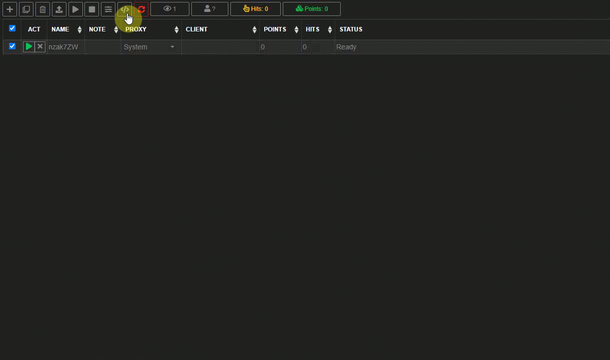
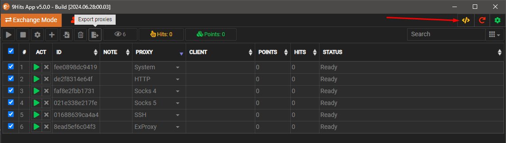
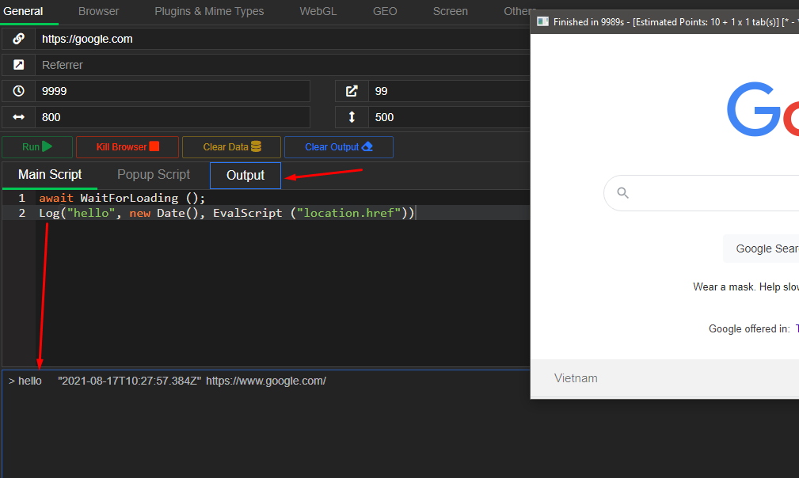

# 9Hits Macros

---------

## What is the 9Hits Macros
9Hits Macros is just javascript language, with a set of [built-in functions](functions.md) that help you create interactions on your website without the user's real interaction. Macros can be set for an [exchange campaign](../9hits-app/exchange/manage-campaign.md#macros), a [bot campaign](../9hits-app/bot/manage-campaign.md) or a [profile](../9hits-app/profile-mode.md).

You may want to see a [basic tutorial](https://forum.9hits.com/threads/9hits-macros-for-beginer.938/).



## Writing your script
Before putting your script into the real mode, you can test to make sure it runs properly. To open the editor, just click the :fontawesome-solid-code:{.txt-warning} button.



Here is an example script
``` js linenums="1"
await WaitForLoading();
await Typing("9hits\r", 100, 200); //\r mean press Enter key
await WaitForLoading();
await ClickBySelector("a[href*='9hits.com']");
```

!!! tip
    Use the [Log](functions.md#log) function would help you in debugging your script.

